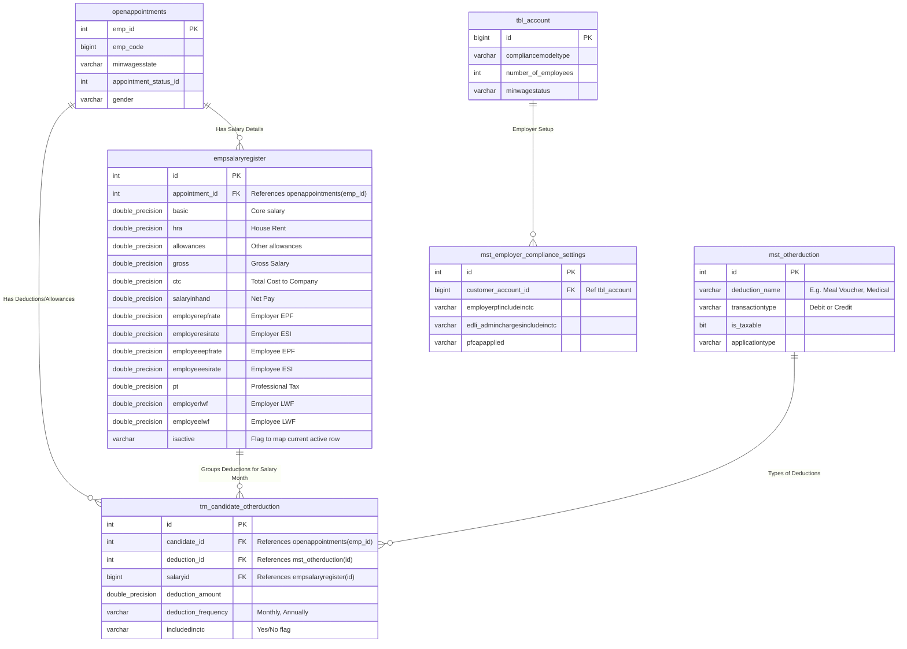
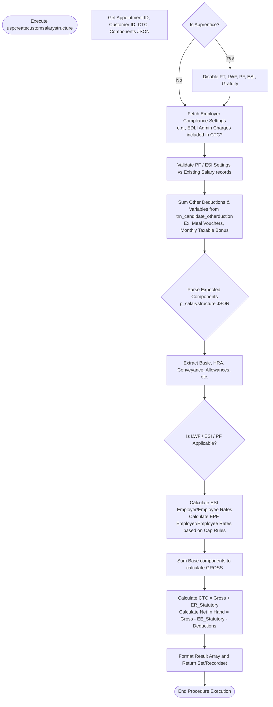
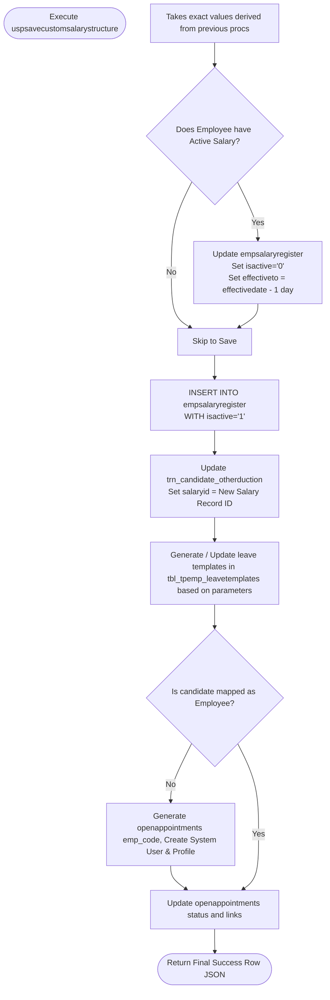

# Detailed Salary Structure Database Analysis

## 1. Database Entity Relationship Diagram (ERD)
The following is a comprehensive ERD mapping the foreign keys and core transaction structures.



---

## 2. Process Flowchart: `uspcreatecustomsalarystructure`
This function is responsible for building the customized breakdown when provided explicit parameters (often a JSON array of specific components).



---

## 3. Process Flowchart: `uspccalcgrossfromctc_withoutconveyance`
This function is a reverse-calculator. Given a target CTC, it figures out the basic pay, statutory compliances, and balances out `allowances` to precisely match the target CTC.

```mermaid
flowchart TD
    Start([Execute uspccalcgrossfromctc_withoutconveyance])
     InputCTC[Input Target CTC: p_monthlyofferedpackage, basic option]
     
     LoadEnv[Load Compliance Models, State Mins, PF Cap Rules]
     LoadEnv --> PreTaxSum[Sum Candidate Specific Other Deductions/Variables]
     
     PreTaxSum --> DetermineBasic{Basic Option Selected?}
     DetermineBasic -->|Option 1 or 5| StandardBasic[Derive Base=CTC/Certain % \n Calculate HRA]
     DetermineBasic -->|Option 2| FixedBasic[Use Provided Basic \n Set HRA/Allowances = 0]
     
     StandardBasic --> InitStat1[Init EPF: Calculate Employer & Employee EPF 12-13%]
     FixedBasic --> InitStat1
     
     InitStat1 --> InitStat2[Init NPS & Govt Bonus if opted]
     
     InitStat2 --> ESICheck{Is ESI Applicable?}
     ESICheck -->|Yes| RevCalcESI[Reverse Calculate ESI:\nGross = (TargetCTC - ER_EPF - ER_LWF) / 1.0325\nAllowances = Gross - Basic - HRA]
     ESICheck -->|No| RevCalcNormal[Normal Calculation:\nGross = TargetCTC - ER_EPF - ER_LWF\nAllowances = Gross - Basic - HRA]
     
     RevCalcESI --> ComputeStatutory[Calculate Explicit ESI (3.25% & 0.75%) locally]
     RevCalcNormal --> ComputeStatutory
     
     ComputeStatutory --> CalcTaxes[Calculate Gratuity, LWF, Professional Tax based on Target Gross]
     
     CalcTaxes --> FinalizePay[Calculate Final Net Salary In Hand & Confirm Target CTC match]
     
     FinalizePay --> OutputSet[Assemble Final Response RefCursor Row]
     OutputSet --> End([End Procedure Execution])

```

---

## 4. Process Flowchart: `uspsavecustomsalarystructure`
This flowchart handles what happens when a computed salary is formally saved to the employee database.


